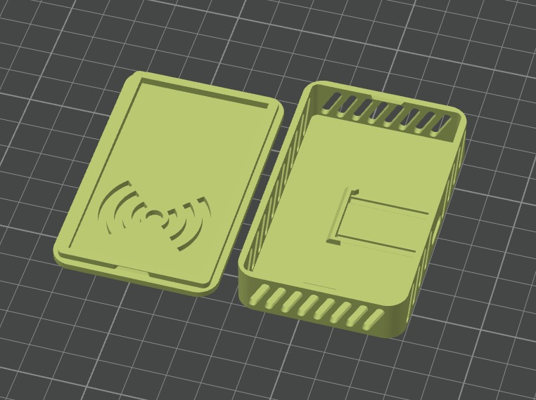
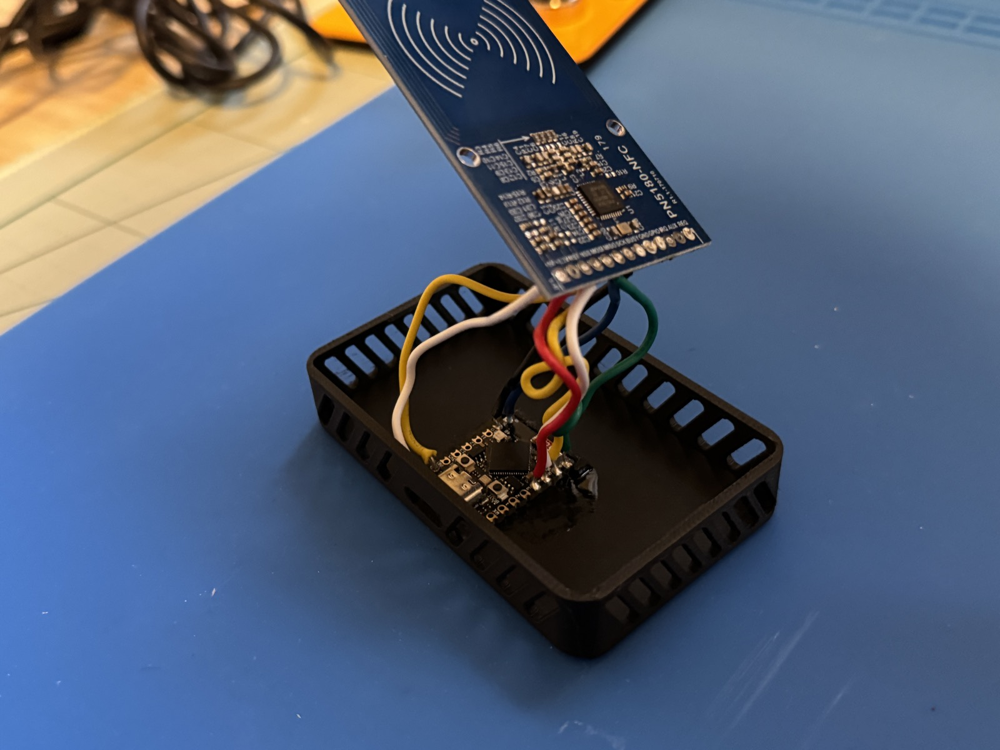
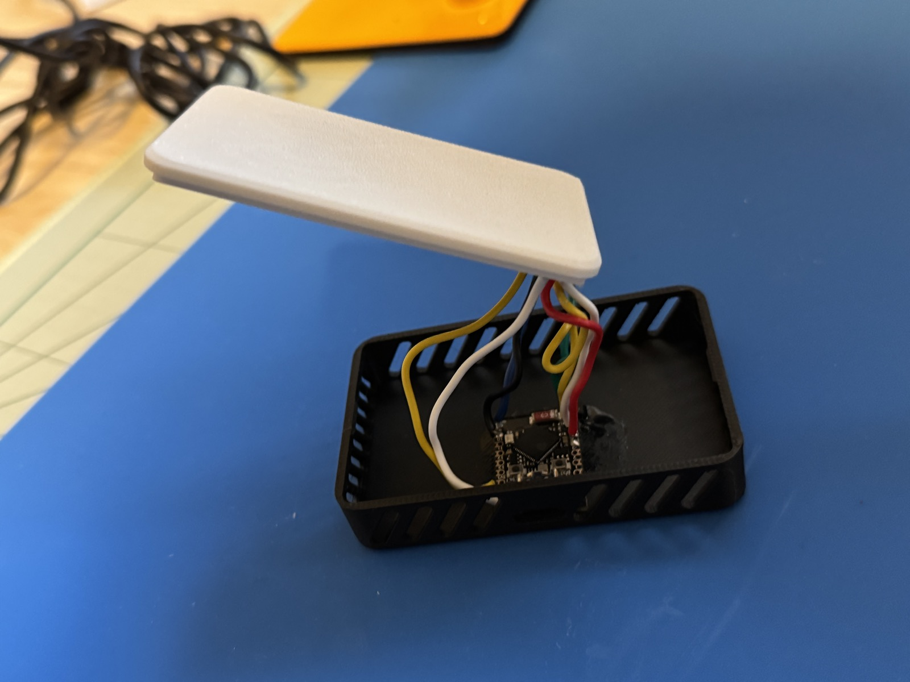
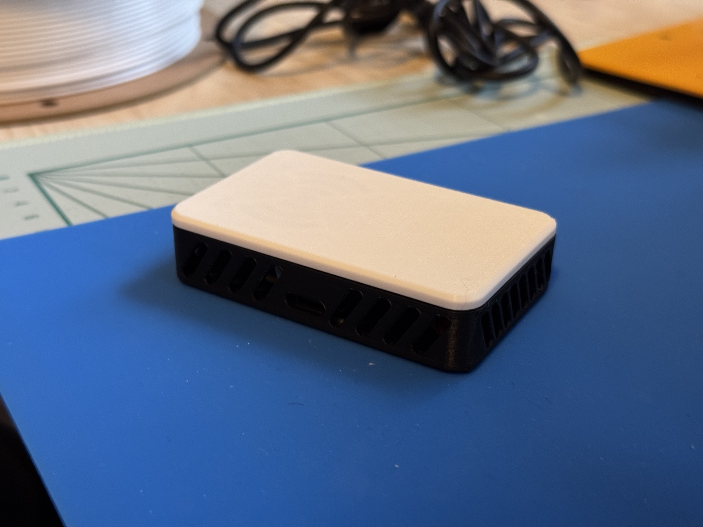

# roomonthethird's Spoolsense NFC Reader Case
Autodesk Fusion 360 files are included if you want to make your own edits.

### Parts Needed
- PN5180
- ESP32-S3-Mini

**NOTE: For this case, you must solder the wires directly to both boards. It will not fit using jumpers and headers.**

### Print Settings
- Standard print settings are fine, no supports needed.
- PETG/PLA/etc, 15%+ infill
-----
- Place the PN5180 NFC side face down on the lid, mating the NFC logo on the board to the printed logo.
- Case is snap fit. If you need to reopen the case, use a small pick or similar object to open it.
- You can add a dab of glue underneath the ESP32 if you want to.
- Stick a piece of double sided tape or a command strip on the back of the case and stick to whatever surface you'd like.

